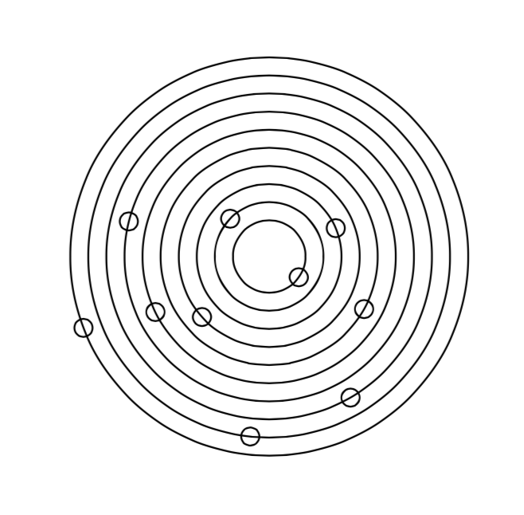

# CS372 - CPS

## Dylan Tucker, Jacob McKenna, Will Fisher, Adam Walters



### April 17th, 2015

---

> The best way to predict the future is to invent it
-- Alan Kay

---

# Problems

* Testing double values!
* Initializer list for vectors
* Xcode crashing!

---

# Interesting Parts!

* Used decorator pattern for building Shapes, Rotating, etc...

* CustomShape can take parameters and implements an element of randomness!

---

# CustomShape

```c++
  CustomShape solar_system(20, 10);
```


---

## Loop for how the solar system is built

```c++
for(auto ii=0; ii<numberPlanets; ++ii)
{
    shared_ptr<Shape> orbit = make_shared<Circle>(firstOrbit + (ii*otherOrbit));
    _shapes.push_back(orbit);

    shared_ptr<Vertical> aPlanet = make_shared<Vertical>(std::initializer_list<shared_ptr<Shape>>({ spacer1 }));

    for(auto jj=0; jj<=ii-1; ++jj)
        aPlanet->push_back(spacer2);

    aPlanet->push_back(planet);
    shared_ptr<Rotate> rotated = make_shared<Rotate>(aPlanet, orientation());

    _shapes.push_back(rotated);
}
```

---

# Thought about our implementation

* Overall it seems to be fairly flexible for compositing different shapes together, although the code required to do so is very verbose

* Would benefit from some sort of Factory implementation
